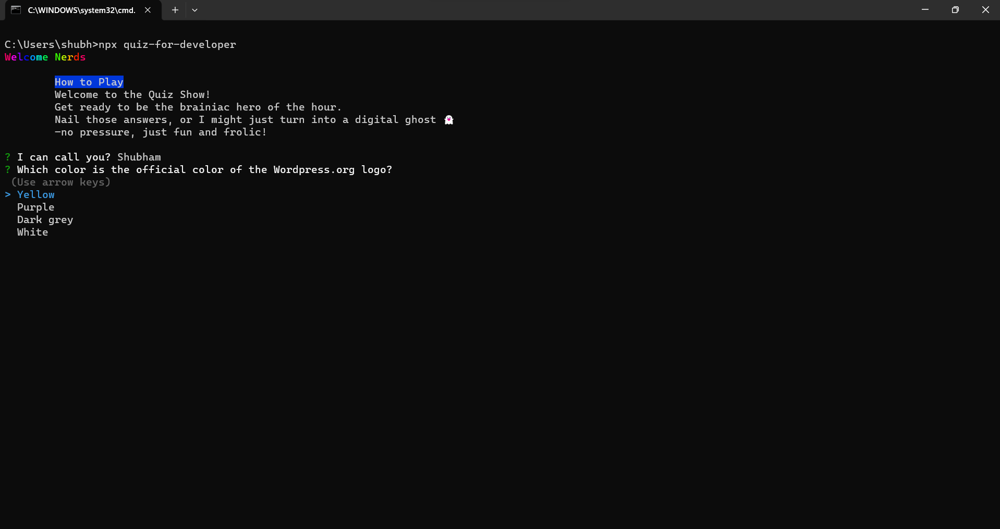

Can be imported and used in command line using 
```bash
npx quiz-for-developer
```
# CLI Quiz App for Developers

A Command Line Interface (CLI) Quiz App for developers, built with Node.js, Axios, and QuizAPI to fetch and display coding-related questions on the command line.

## Features

- **Quiz Questions:** Retrieve and display coding-related questions from QuizAPI.
- **User Interaction:** Allow users to answer questions interactively in the command line.
- **Score Tracking:** Keep track of the user's score throughout the quiz.

## Prerequisites

Make sure you have the following installed on your machine:

- [Node.js](https://nodejs.org/)
- [npm](https://www.npmjs.com/)


